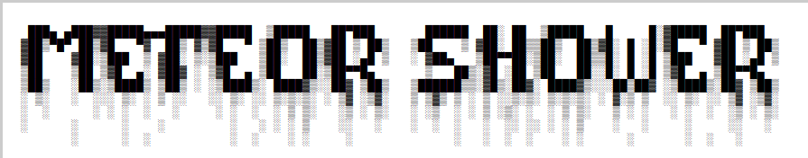

# METEOR SHOWER

[platform-linux-badge]: https://img.shields.io/badge/platform-linux-brightgreen
[platform-macos-badge]: https://img.shields.io/badge/platform-macos-lightgrey
[platform-windows-badge]: https://img.shields.io/badge/platform-windows-blue

![Platform: Linux][platform-linux-badge]
![Platform: macOS][platform-macos-badge]
![Platform: Windows][platform-windows-badge]

                                      

A simple bookmark extractor for firefox and chromium based browsers from all users on the machine.

Just printing bookmark through std for now.

Planning on extracting into .json, .xml, .yaml formats.

## Go
Run

```bash
go get github.com/mattn/go-sqlite3
go run ./meteor-shower
```

Build

```bash
cd meteor-shower

GOOS=linux GOARCH=amd64 go build -o bookmark-linux # linux

GOOS=windows GOARCH=amd64 go build -o bookmark.exe # windows

GOOS=darwin GOARCH=amd64 go build -o bookmark-macos
```
